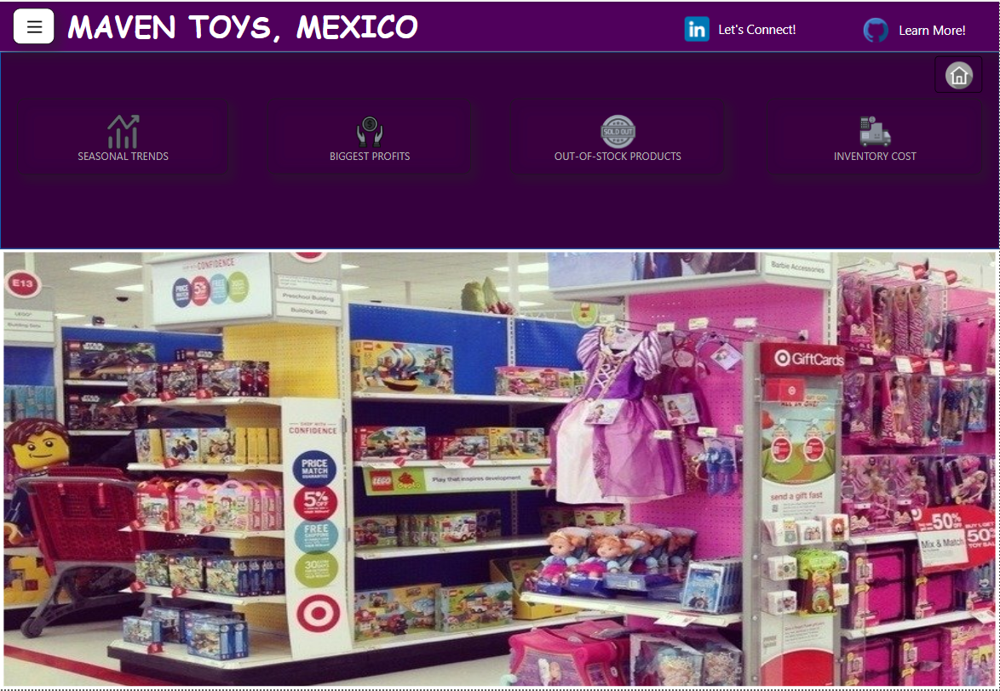
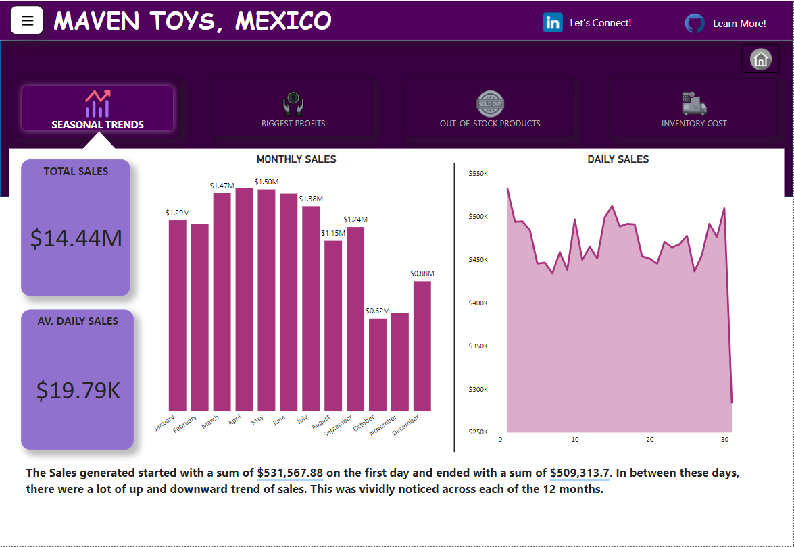

# MAVEN TOY STORES, MEXICO

---

## INTRODUCTION
This is a power BI project on a **FICTITIOUS** toy store called **Maven Toy Stores** located in Mexico. The dataset was gotten from Maven Analytics (https://www.mavenanalytics.io/data-playground?tags=10btmr8wmkqkEgJMfgtOv2). It had four tables; Inventory (1593 rows and 3 columns), Products (35 rows and 5 columns), Sales (829,262 rows and 5 columns) and Store Tables (50 rows and 5 columns).

### Problem Statement:
The project was to analyze and derive insigts to answer specific questions set by Maven Analytics about the dataset;
- Which product categories drive the biggest profits? Is this the same across store locations?
- Can you find any seasonal trends or patterns in the sales data?
- Are sales being lost with out-of-stock products at certain locations?
- How much money is tied up in inventory at the toy stores? How long will it last?

### Resources:
This project took me about 10 days (an average of 2 hours daily) to complete. I had initially completed it under 4 days but after watching a youtube video by Microsoft Reactor on 'Documenting Data Analysis Project on Github' (https://www.youtube.com/watch?v=GLIwyoPWrHs&t=1706s), I got inspired to make my report more interactive and so began days of learning and upskilling to finally get my final report 😫. Listed below are some of the resources I had used to compute my report;
- https://www.youtube.com/watch?v=SCI9iKl4vjU&list=PPSV
- https://www.youtube.com/watch?v=cFZtUzABOa8&list=PPSV
- https://www.youtube.com/watch?v=dTEmhPbtipc&list=PPSV
- https://www.youtube.com/watch?v=WspwLOp3UxA&list=PPSV

First Report                          |                              Final Report
:------------------------------------:|:----------------------------------------:
    |  

### Skillsets:
In carrying out this project, the underlisted Power BI features were used;
- DAX (for calculated columns and new measures)
- Visualization
- Filters
- Dynamic Narrative
- Buttons
- Bookmarks
- Selection and Grouping
- Tooltips

## EXPLORATORY DATA ANALYSIS
### Data Cleaning:
The dataset used was clean and did not need any further transformation. This was checked using the Power Query Editor and the Validity for each column of the tables were 100%. 

### Data Modelling:
The auto-generated relationships between the tables were used (even though we could get other relationships), as it was suitable for this project. The model was a Star Schema with relationship Many:1 and 1:Many.

### Data Analysis Expression (DAX): 
I had added new columns and new measures using DAX. All the expressions I had added are listed below;
- Calculated Columns;
  1. <code> <mark>Cost = sales[Units]*RELATED(products[Product_Cost])</mark> </code>
  2. <code> <mark>Sales = sales[Units]*RELATED(products[Product_Price])</mark> </code>
  3. <code> <mark>Profit = sales[Sales]-sales[Cost]</mark> </code> 
- New Measures;
  1. <code> <mark>%  Profit Contribution = DIVIDE(SUM(sales[Profit]),SUMX(ALL(sales),sales[Profit]))</mark> </code>
  2. <code> <mark>Average Daily Sales = SUMX(sales,sales[Sales])/DISTINCTCOUNT(sales[Date].[Date])</mark> </code>
  3. <code> <mark>Out_of_Stock = CALCULATE(VALUES(inventory[Inventory_at_Hand]),FILTER(inventory,inventory[Inventory_at_Hand]=0))</mark> </code>
  4. <code> <mark>Profit Margin = SUMX(SALES, sales[Profit])/SUMX(sales, sales[Sales])</mark> </code>
  5. <code> <mark>Inventory Days = inventory[Inventory Cost]/[Average Daily Sales]</mark> </code>
  6. <code> <mark>Inventory Cost = SUMX(inventory,inventory[Inventory_at_Hand] * RELATED(products[Product_Cost]))</mark> </code>
  7. <code> <mark>Av_Units_of_Products_Sold_Daily = SUMX(sales,sales[Units])/DISTINCTCOUNT(sales[Date].[Date])</mark> </code>

### Visualization and Insights:
The final report created is a simple interactive dashboard with clickable buttons that navigates you to various information/insights about the report. The button and bookmark features of Power BI were used to make the report interactive.
- Homepage:
The default Homepage as seen in the Visual below will always come up anytime the Homepage button by the right-hand side is clicked. The linkedIn icon takes you to my LinkedIn profile (kindly connect) while the github icon takes you to this repository 😃.

- Menu and Close Button:
This opens up the Filter pane where we have different slicers for Year, Month, Product, Location and Store used to filter the report for Specific information.

- Seasonal Trends Button:
This opens up visuals that shows;
  1. Total Sales = $14,44M,
  2. Average Daily Sales = $19.79K,
  3. Monthly Sales = A clustered column chart visual that shows the total Sales recorded each Month,
  4. Daily Sales = An area chart visual that shows the total sales recorded each day of the stores.

It was observed that the Sales (Revenue) fluctuated a lot resulting in an up and downward trend of sales. This was noticed across each of the month of the two years.

- Biggest Profits Button:
This takes us to the underlisted visuals;
  1. Total Profit = $4.01M,
  2. Profit Margin = 27.79%,
  3. Top Category by Profit = Toys,
  4. Top Category by Profit Margin = Electronics,
  5. Profit/Profit Margin by Location = A stacked column chart that shows Profit/Profit Margin by Store Locations,
  6. Profit/Profit Margin by Category = A donut chart that shows Profit/Profit Margin by Product Categories.
  7. Two buttons were also added here to navigate through the Visuals by Profit and by Profit Margin

By Profit                    |                    By Profit Margin
:---------------------------:|:----------------------------------:
     |

